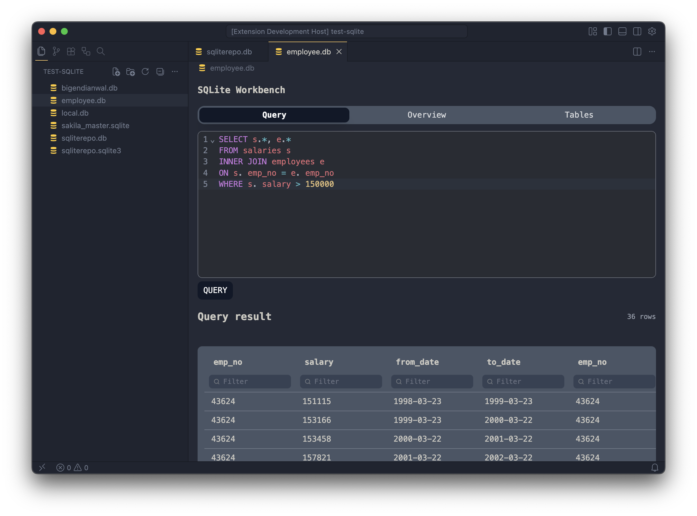
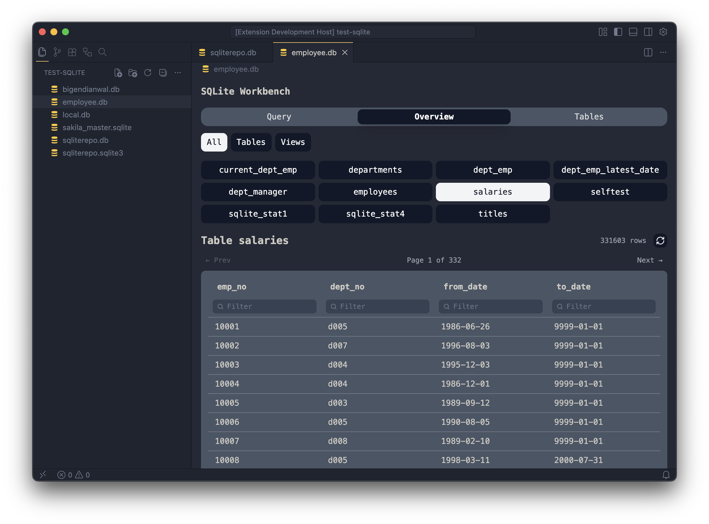
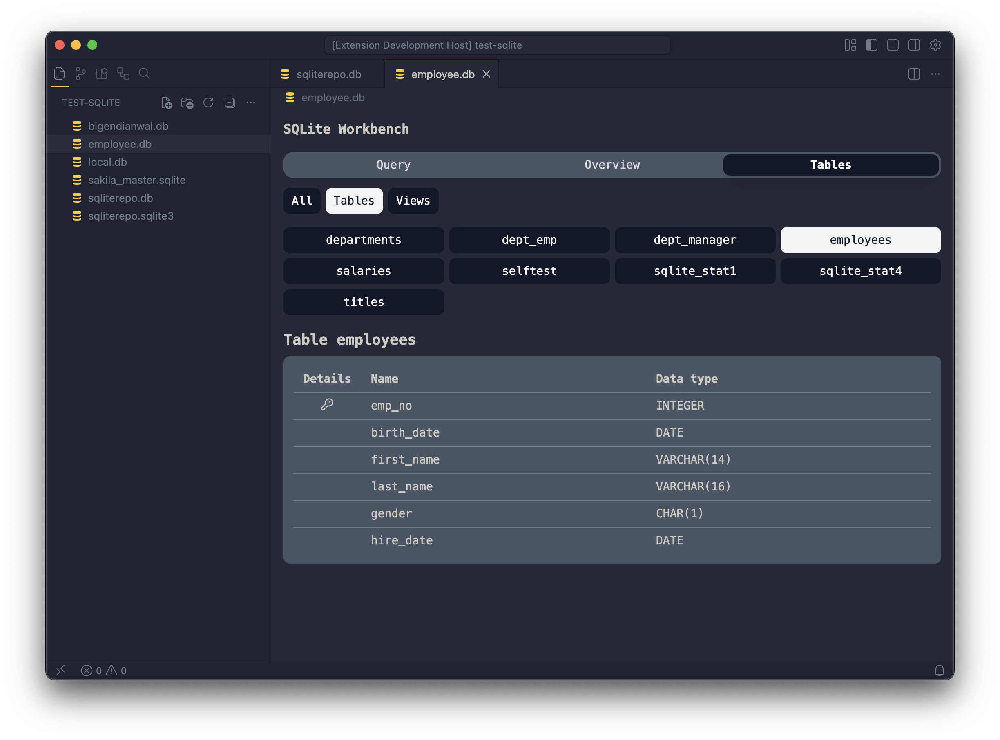

# SQLite Workbench

A VS Code extension for viewing and querying SQLite databases.

## Features

- **Browse tables:** view all tables and views in your database, filtered by type (All / Tables / Views)
- **Sort and filter:** sort and filter each columns
- **Query editor:** write and run SQL queries with syntax highlighting and autocomplete
- **Paginated results:** large result sets are paginated for fast rendering
- **Inline record editing:** click any cell to edit the contents of it
- **Light & dark theme:** the query editor automatically follows your VS Code theme

## Images

